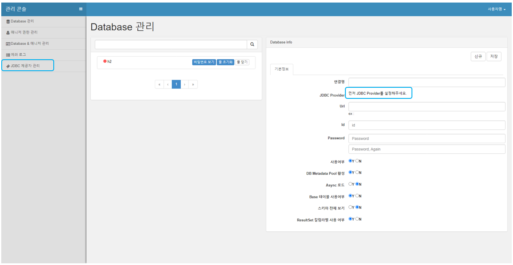
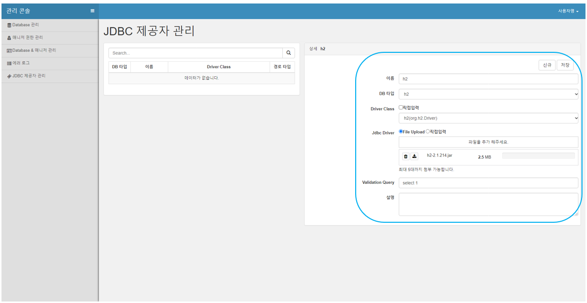
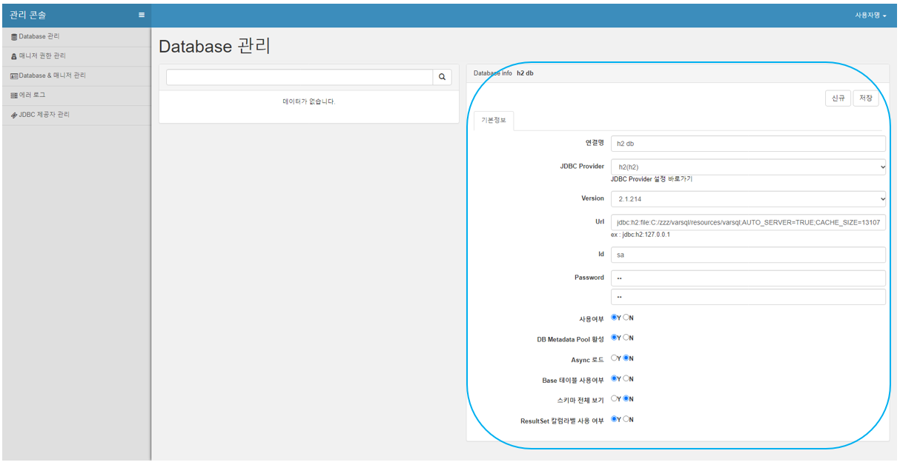

# DB Connection Setup

## JDBC Driver Setup

1. Click on JDBC Provider Management  
   
2. Enter the JDBC driver information and click Save  
   

## DB Connection

Enter the connection DB information and click Save  

