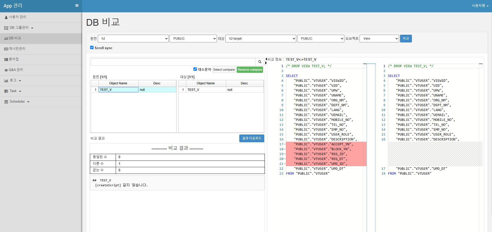

# DB Object Comparison

## Table Comparison

Select **DB Comparison** menu  

- Source: Source DB
- Schema: Source Schema
- Target: DB to compare
- Schema: Schema to compare
- Object: Table

Click the Compare button

## Table Comparison Results

### Comparing Tables with the Same Name

1. Select the source table
2. Check the comparison information on the right

### Comparing Tables with Different Names in DB

1. Select the source table
2. Select the target table
3. Click Select Compare
4. Check the comparison information on the right

## Comparing Objects Other Than Tables

- Source: Source DB
- Schema: Source Schema
- Target: DB to compare
- Schema: Schema to compare
- Object: Select object other than table

1. Select the source comparison object
2. Check the comparison information on the right
