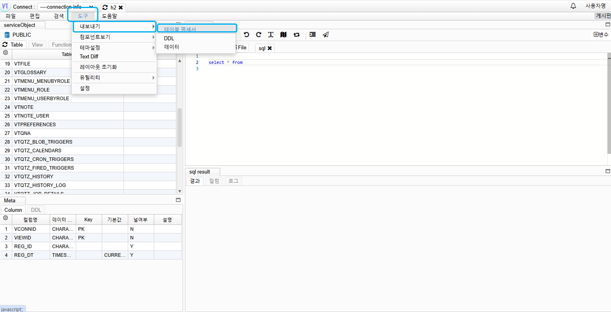

# Export Table Specification

## Export Specification

Go to Tools -> Export -> Click on Table Specification

## Input Information

- File Name: Specification file name
- Table Definition: Whether to add a summary of the exported table information
- Multiple Sheets for Tables: Whether to export the table specification as multiple sheets or a single sheet

Click Next

## Select Table

Select table

Click Next

## Export Column Information

Select columns to export -> Click Finish
