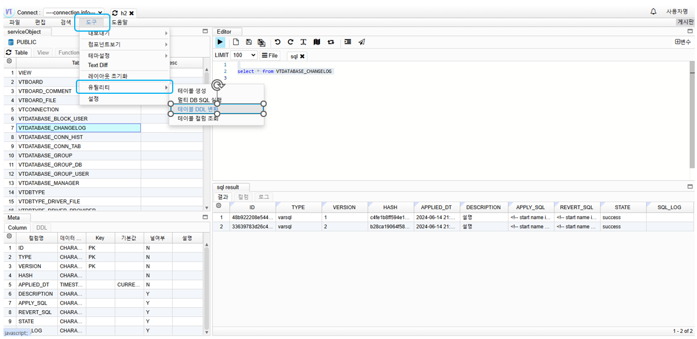
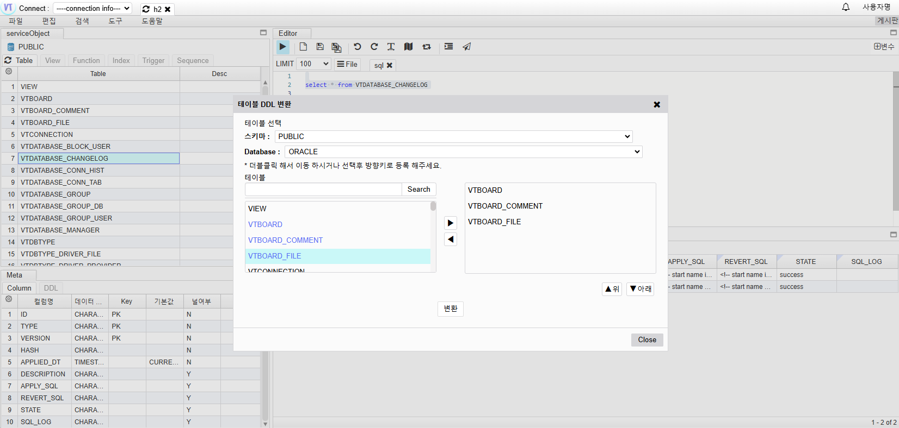
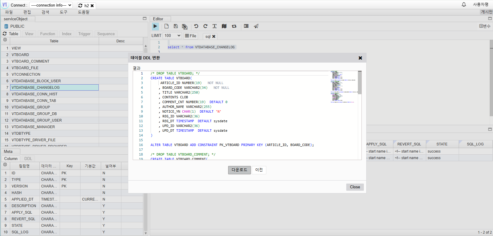

# Table DDL Conversion

## Table DDL Conversion

Go to Tools -> Utilities -> Click on Table DDL Conversion

## Input Information

- Schema: Select the schema to convert
- Database: Select the database to change
- Table: Select the table to change

Click Convert

## Table DDL Conversion

Click Download
