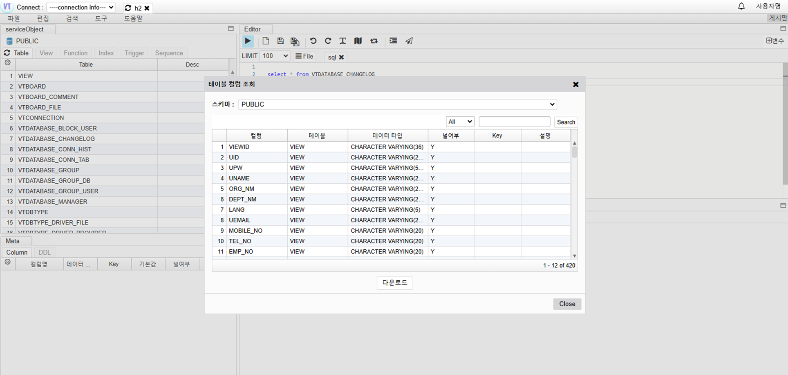

# View All Table Columns

## View All Table Columns

Go to Tools -> Utilities -> Click on Table Column Search

## Input Information

- Schema: Select the schema to search
- Search: Enter the column to search and click Search

## Download the Retrieved Columns

Excel download result

