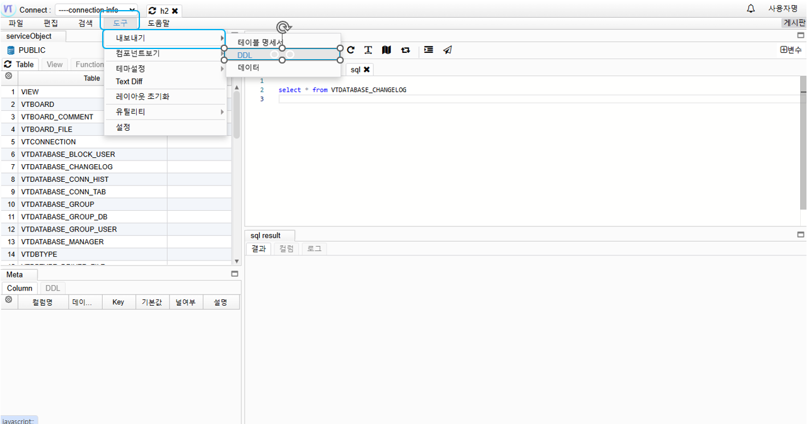
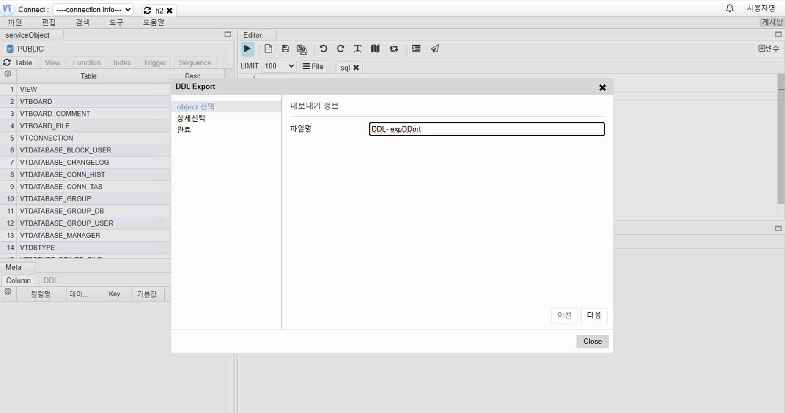
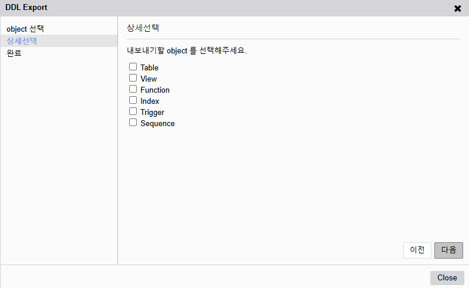
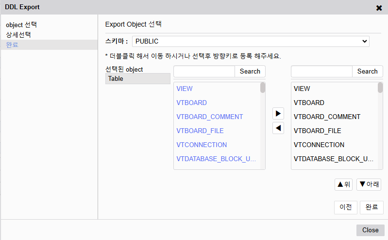
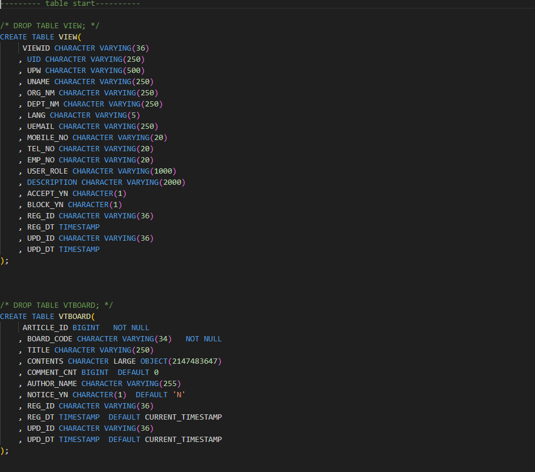

# Export DDL

## Export DDL

Go to Tools -> Export -> DDL

## Enter Export Information

- File Name: Enter the name of the export file

Click Next

## Select Objects to Export

Click Next

## Select Export Items

Click Finish

DDL

