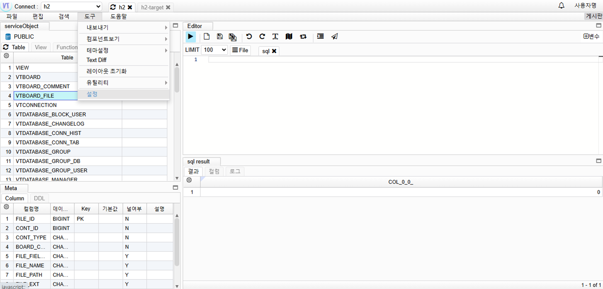

# Create Table Template Information

## Template Information Setup

1. Go to Tools -> Settings  
   

2. Create a New Context Menu  
   

   1. Enter the context name
   2. Click Save

3. Create Sub-Template  
   

   1. Click the Add Sub button
   2. Enter the context name
   3. Select the display method
   4. Register the Handlebar (see help) template
   5. Click the Apply button

4. Check Context Template  
   

   1. Click the Refresh button
   2. Select the table and right-click
   3. Select the newly added template
   4. Select the sub-menu
   5. Check the template
