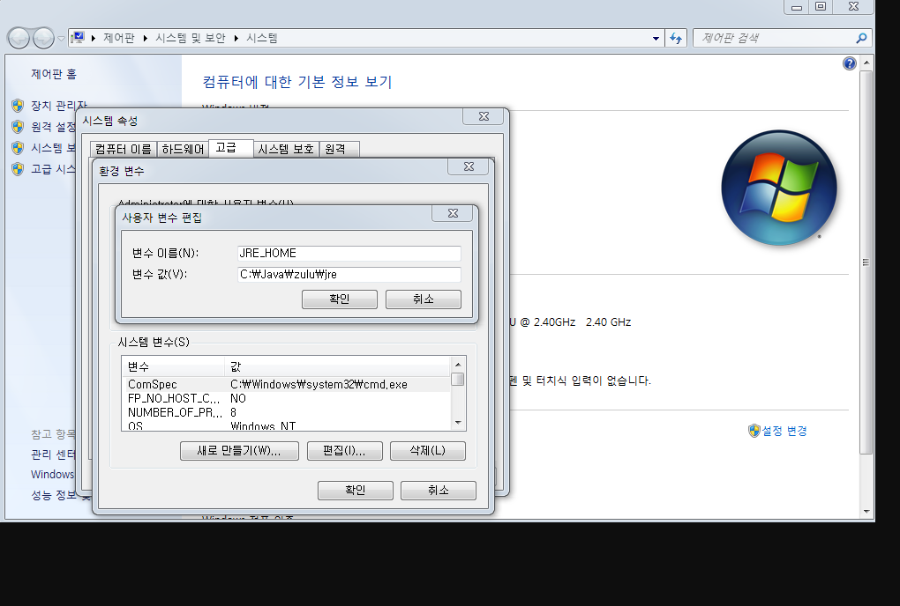

# Issues After Installation

## JRE_HOME on Execution

Execution:

- Windows: [extracted_path]/bin/startup.bat
- Linux: [extracted_path]/bin/startup.sh

1. This issue occurs when the JRE_HOME system variable is not registered. The log message will be:
   "The JRE_HOME environment variable is not defined correctly. This environment variable is needed to run this program."

2. Action:
   Right-click on My Computer -> Click Properties -> Advanced System Settings -> Click Environment Variables
   Click New and enter the following:

## JAVA_HOME

Variable Name: JAVA_HOME  
Variable Value: [Add the Java installation path here and confirm] e.g., C:\Java\zulu  

## JRE_HOME

Variable Name: JRE_HOME  
Variable Value: [Add the Java installation path here and confirm] e.g., C:\Java\zulu\jre  

