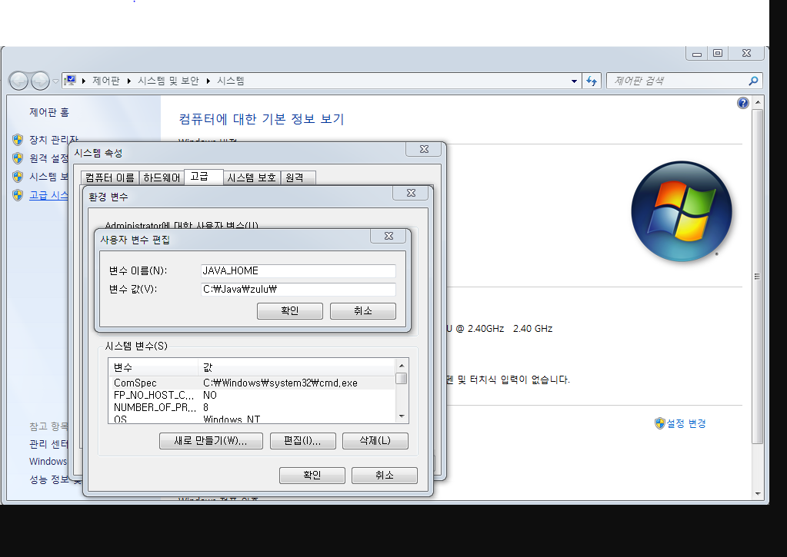
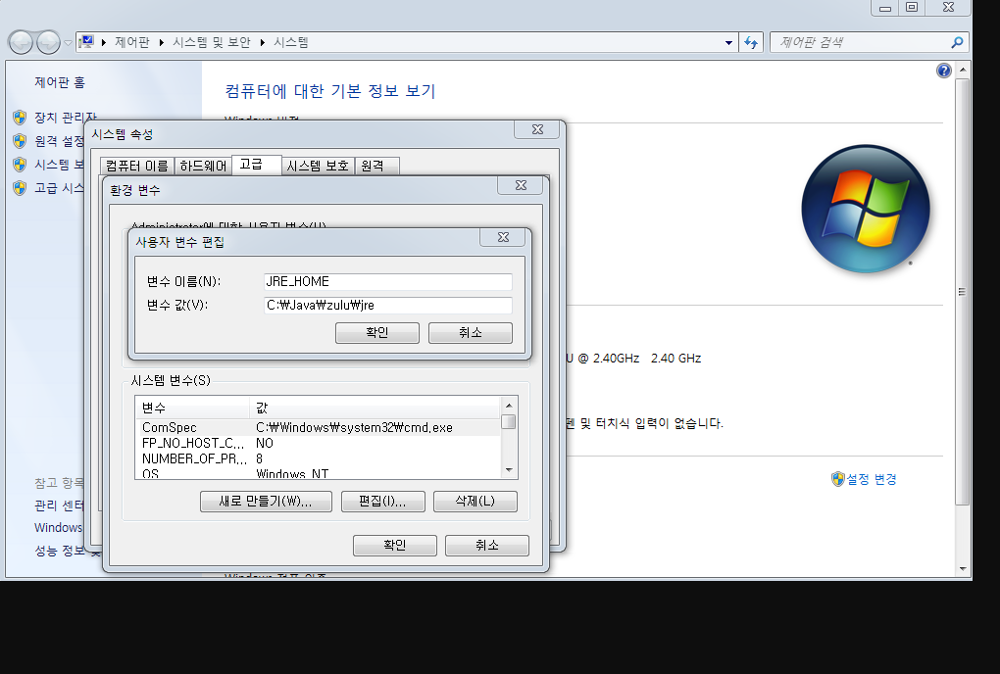

# 설치 후 실행 문제

## 실행시 JRE_HOME

실행 :
window : [압축해제경로]/bin/startup.bat
linus : [압축해제경로]/bin/startup.sh

1. JRE_HOME 이 시스템 변수에 등록되어있지 않을경우 발생. 로그
   The JRE_HOME environment variable is not defined correctly This environment variable is needed to run this program

2. 조치
   내컴퓨터-> 마우스 오른쪽후 속성 클릭 -> 고급 시스템 설정 -> 환경변수 클릭
   새로만들기 클릭후

## JAVA_HOME

변수 이름 : JAVA_HOME  
변수값 : ["java설치 경로 추가 후 확인"] ex)C:\Java\zulu

## JRE_HOME

변수 이름 : JRE_HOME  
변수값 : ["java설치 경로 추가 후 확인"] ex)C:\Java\zulu\jre

