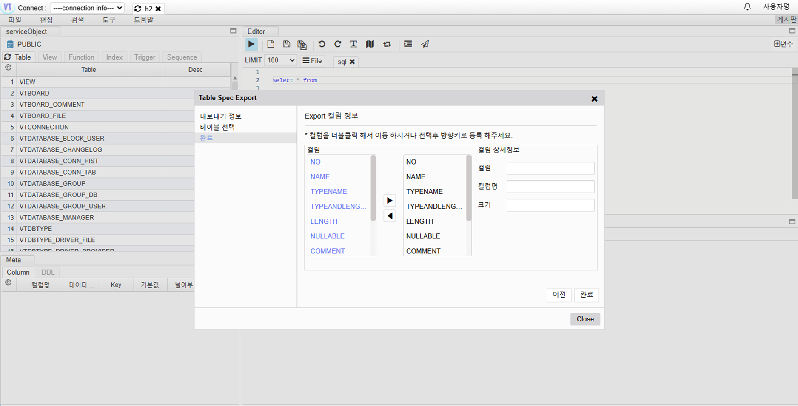

# 테이블명세서 내보내기

## 명세서 내보내기

도구-> 내보내기 -> 테이블 명세서 클릭

## 정보입력

- 파일명 : 명세서 파일명
- 테이블정의서 : 내보내기 하는 테이블 정보 요약을 추가 할지 여부
- 테이블 다중시트여부 : 테이블 명세서를 다중 시트로 내보낼지 하나로 내보낼지 여부

다음

## 테이블 선택

테이블 선택

다음

## Export 컬럼 정보

내보내기 컬럼 선택후 -> 완료
