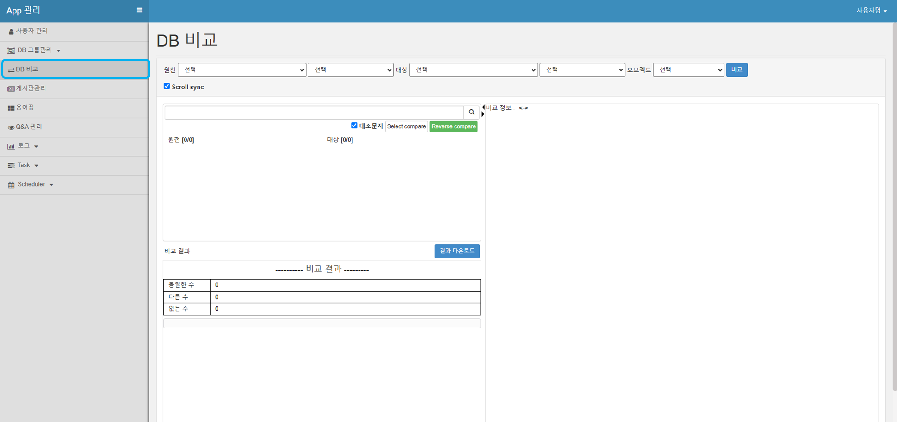
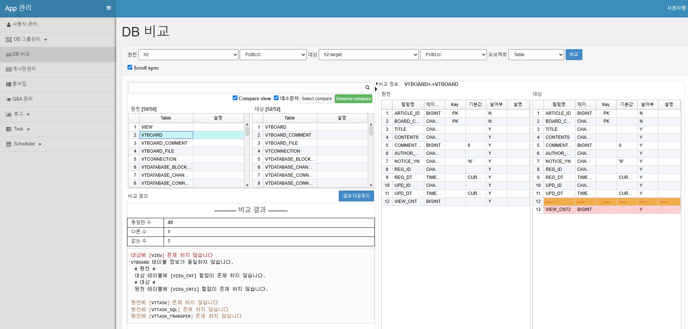
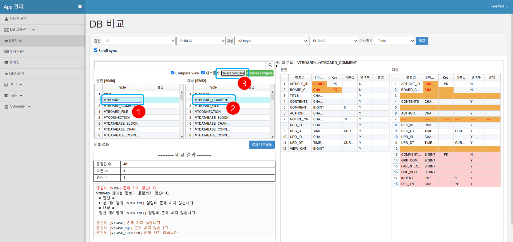
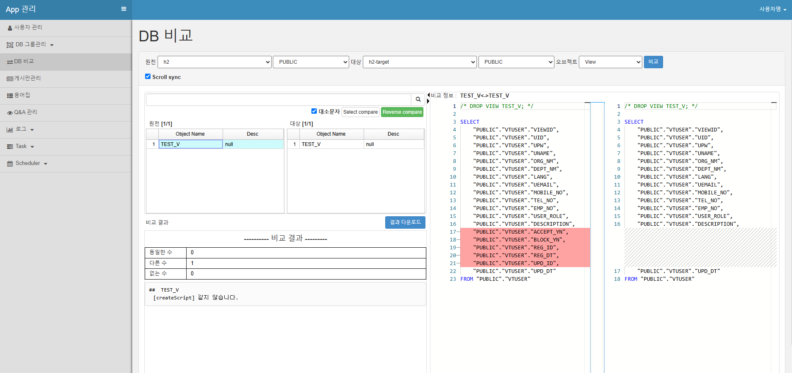

# DB Object 비교

## Table 비교

**DB 비교** 메뉴 선택

- 원천 : 원천 DB
- 스키마 : 원천 스키마
- 대상 : 비교할 DB
- 스키마 : 비교할 스키마
- 오브젝트 : table

비교 버튼 클릭

## Table 비교 결과

### Table명이 같은 것 비교

1. 원천 테이블 선택
2. 오른쪽에 비교 정보확인

### 테이블명이 다른 DB 비교

1. 원천 테이블 선택
2. 대상 테이블 선택
3. select compare 클릭
4. 오른쪽에 비교 정보확인

## 테이블 외 오브젝트 비교

- 원천 : 원천 DB
- 스키마 : 원천 스키마
- 대상 : 비교할 DB
- 스키마 : 비교할 스키마
- 오브젝트 : table외 오브젝트 선택

1. 원천 비교 Object를 선택
2. 오른쪽에 비교 정보확인
