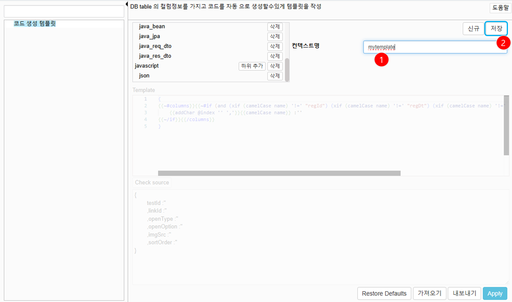
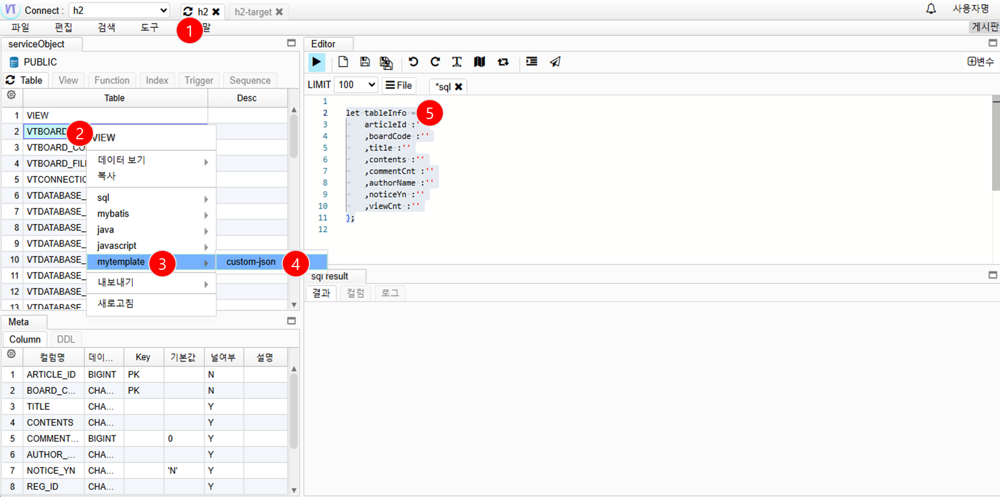

# 테이블 템플릿 정보 생성

## 템플릿 정보 설정

1. 도구 -> 설정
   

2. 신규 컨텍스트 메뉴 생성
   

   1. 컨텍스트명 입력
   2. 저장 클릭

3. 하위 템플릿 생성
   

   1. 하위 추가 버튼 클릭
   2. 컨텍스트명 입력
   3. 보기방식 선택
   4. handlebar(도움말 참고) 템플릿 등록
   5. Apply 버튼 클릭

4. 컨텍스트 템플릿 확인
   
   1. 새로고침 버튼 클릭
   2. 테이블 선택후 오르쪽 마우스 클릭
   3. 새로 추가된 템플릿 선택
   4. 하위 메뉴 선택
   5. 템플릿 확인
